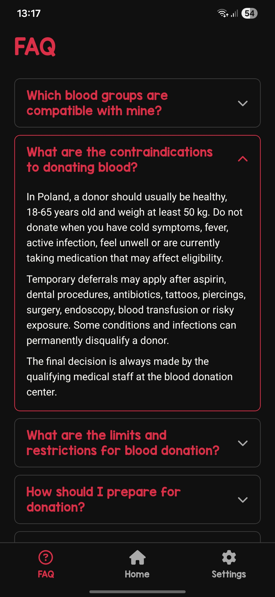
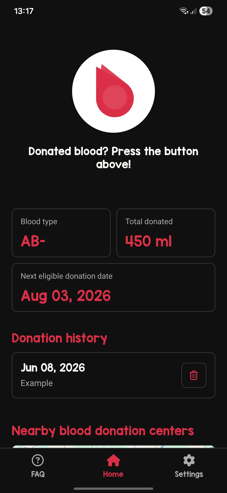
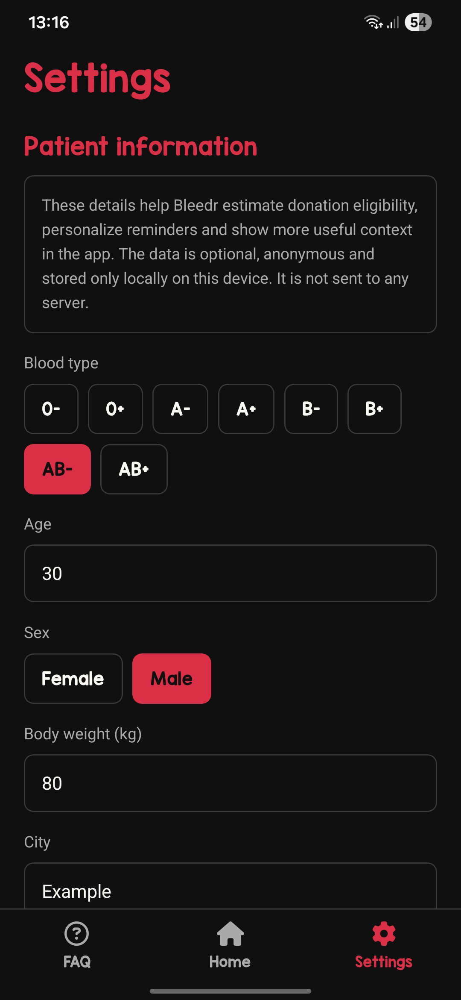

# Bleedr

Bleedr is my take on vibe coding: a lightweight Expo app for blood donors.

## Features

- track donation history, total donated blood volume, and the next eligible donation date,
- add and manage donor profile details,
- browse FAQ content about blood donation,
- find nearby blood donation centers with Google Places,
- switch between supported languages and themes.

## Installation

1. **Clone this repository**

   ```bash
   git clone git@github.com:f1shuu/bleedr.git
   ```

2. **Install dependencies**

   ```bash
   npm install
   ```

3. **Create a local environment file**

   ```bash
   cp .env.example .env
   ```

4. **Add your Google Places API key**

    ```bash
    EXPO_PUBLIC_GOOGLE_PLACES_API_KEY=your_google_places_api_key_here
    ```

5. **Start the project**

   ```bash
   npx expo start
   ```

## Download

You can download the latest Android APK from the [Releases](https://github.com/f1shuu/bleedr/releases) page.

## Screenshots

<div align="center" style="display:flex;justify-content:center;gap:10px;flex-wrap:nowrap;">
    
    
    
</div>

## Tech Stack

- React Native,
- Expo SDK 54,
- JavaScript,
- AsyncStorage,
- Expo Location,
- React Native Maps,
- Google Places API,
- Expo Vector Icons,
- React Native Safe Area Context,
- React Native DateTimePicker.

## Notes

- User data is stored locally on the device through AsyncStorage.
- Whole blood donations are counted as 450 ml.
- The next eligible donation date uses a minimum 56-day break and yearly limits: 4 donations for women, 6 for men.
- If sex is not set, the app assumes the male limit by default.

## License

This project is licensed under the MIT License.
